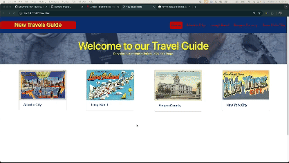
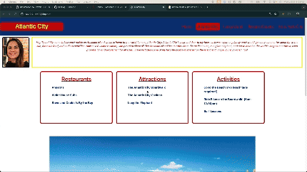

# Name

New Travels Guide

# Description

Our travel guide has been created in hopes that potential tourists/visitors are able to seamlessely navigate between given cities within a Tri-State region. When potential tourists/visitors navigate to a selected city, they are able to learn about the given city and select items of interest that will then be rendered to the landing page to create a list of points of interest for a variety of cities.

# Visuals

## Landing Page

## Blog Page

# Usage

USER STORY

As a tourist/visitor,
I want a Tri-State Travel Guide,
So that I can learn about cities within the region as described by locals and keep a list of potential restaurants/attractions/activities to visit in given cities.

Acceptance Criteria

GIVEN a Travel Guide,
WHEN I load the app,
THEN I am presented with the landing page that has navigation to each city represented within the travel guide and postcards representing each city,
WHEN I select a city within the navigation,
THEN I am brought to that city’s blog page where I am able to view the blogger’s picture, a description of the blogger’s personal connection to the city, and lists of restaurants/attractions and activities,
WHEN I review the items within the restaurants/attractions/activities lists,
THEN I am able to select items that I desire to potentially visit,
WHEN I review the items,
THEN I am able to view pictures within a carousel that represent select items within the lists,
WHEN I select an item from the blog page of the selected city,
THEN it will appear on the landing page within the postcard of the city in which I have selected its item
WHEN I have visited said item or no longer desire to visit said item,
THEN I am given the option to deselect the item when it is rendered to the landing page

# Support

Please contat David, Alex, Kevin, or Mathew for further assistance.

# Roadmap

It is our vision that this blog will become grow so that local residents within the given Tri-State area (New Jersey, New York, Pennsylvania) are able to contribute a new blog page for their city. They will be able to list exciting attractions, reputable restaurants, and endless activities that their cities have to offer.

# Contributing

As a team, we welcome suggestions, contributions, and constructive feedback to all who are willing to provide.

# Authors and acknowledgment

This travel guide was achieved through the use of a collaborative approach by David, Alex, Kevin, and Mathew.

# License

MIT License

Copyright (c) 2024 David Umana

Permission is hereby granted, free of charge, to any person obtaining a copy
of this software and associated documentation files (the "Software"), to deal
in the Software without restriction, including without limitation the rights
to use, copy, modify, merge, publish, distribute, sublicense, and/or sell
copies of the Software, and to permit persons to whom the Software is
furnished to do so, subject to the following conditions:

The above copyright notice and this permission notice shall be included in all
copies or substantial portions of the Software.

THE SOFTWARE IS PROVIDED "AS IS", WITHOUT WARRANTY OF ANY KIND, EXPRESS OR
IMPLIED, INCLUDING BUT NOT LIMITED TO THE WARRANTIES OF MERCHANTABILITY,
FITNESS FOR A PARTICULAR PURPOSE AND NONINFRINGEMENT. IN NO EVENT SHALL THE
AUTHORS OR COPYRIGHT HOLDERS BE LIABLE FOR ANY CLAIM, DAMAGES OR OTHER
LIABILITY, WHETHER IN AN ACTION OF CONTRACT, TORT OR OTHERWISE, ARISING FROM,
OUT OF OR IN CONNECTION WITH THE SOFTWARE OR THE USE OR OTHER DEALINGS IN THE
SOFTWARE.

# Project status

Deployed  
[Link to Website](https://devumana.github.io/New-Travels-Guide/)
